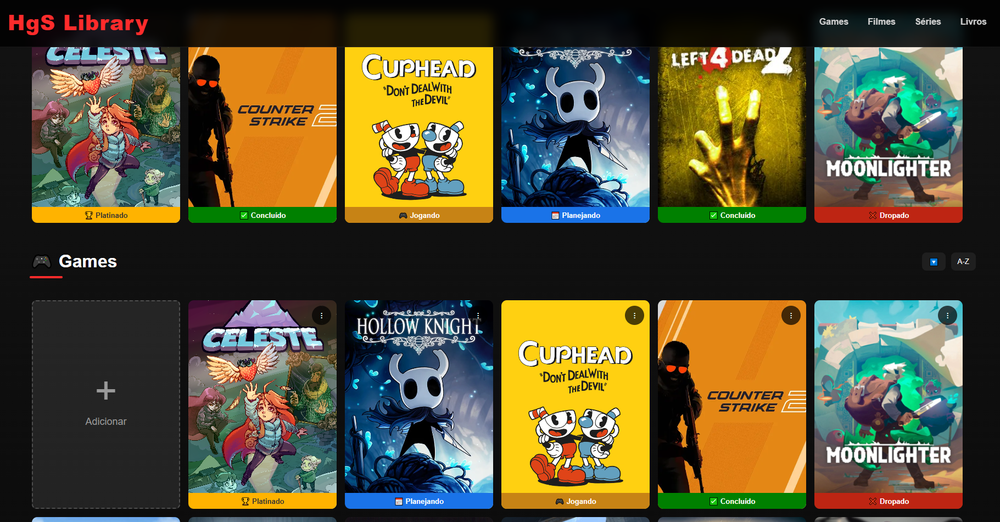
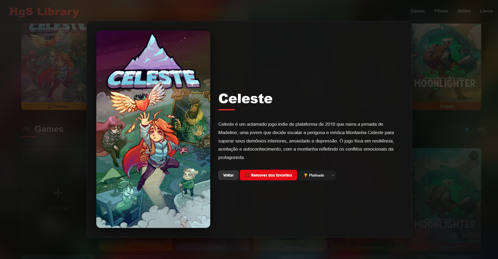
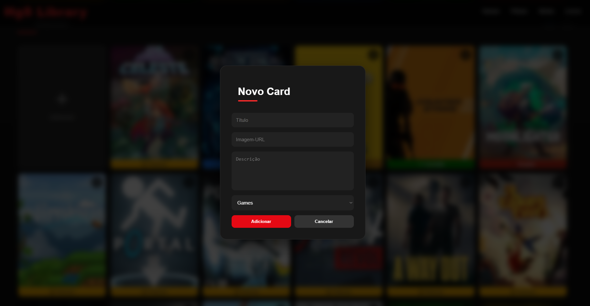

# 🎮 HgS Library

Uma biblioteca pessoal feita em **HTML, CSS e JavaScript** para organizar:

* 🎮 Games
* 🎬 Filmes
* 📺 Séries
* 📚 Livros

O projeto foi criado com foco em praticar desenvolvimento web puro (**sem frameworks**) enquanto evolui gradualmente para uma aplicação mais dinâmica e organizada.

---

# ✨ Funcionalidades

## 📌 Sistema de Favoritos

* Adicionar e remover favoritos
* Atualização dinâmica dos ícones
* Favoritos separados por categoria

## 🎯 Sistema de Status

Cada mídia possui status personalizados:

### Games

* Jogando
* Concluído
* Dropado
* Platinado
* Planejando

### Filmes e Séries

* Assistindo
* Assistido / Finalizada
* Dropado
* Planejando

### Livros

* Lendo
* Lido
* Abandonado
* Planejando

---

# 🗂️ Organização por Categorias

O sistema separa os cards entre:

* Games
* Filmes
* Séries
* Livros

---

# ➕ Sistema Dinâmico de Cards

O usuário pode:

* Criar novos cards
* Remover cards
* Adicionar imagem
* Adicionar descrição
* Escolher categoria

Tudo diretamente pela interface.

---

# 💾 Armazenamento Local

O projeto utiliza:

## IndexedDB

Para salvar:

* Cards
* Favoritos

## LocalStorage

Para salvar:

* Status
* Preferências da interface

Todos os dados ficam salvos apenas no navegador do usuário.

---

# ⚡ Tecnologias Utilizadas

* HTML5
* CSS3
* JavaScript Vanilla
* IndexedDB

---

# 🎨 Objetivo do Projeto

O objetivo principal foi estudar:

* Manipulação de DOM
* Renderização dinâmica
* Persistência de dados
* Organização de código
* Estruturação de aplicações front-end sem frameworks

Além disso, o projeto foi evoluindo gradualmente durante o desenvolvimento, simulando o crescimento real de uma aplicação web.

---

# 🚀 Como Executar

Basta abrir o arquivo:

```txt
index.html
```

em qualquer navegador moderno.

---

# 📌 Futuras Melhorias

* Sistema de comunidade
* Contas online
* Sincronização em nuvem
* Sistema de pesquisa
* Filtros avançados
* Melhor responsividade
* Animações e transições
* Deploy online completo
* Sistema de conquistas linked com Steam

---

# 📷 Preview
Tela Inicial

Detalhes

Criação de Cards

---

# 👨‍💻 Autor

Projeto desenvolvido por Henrique Grisa. 
